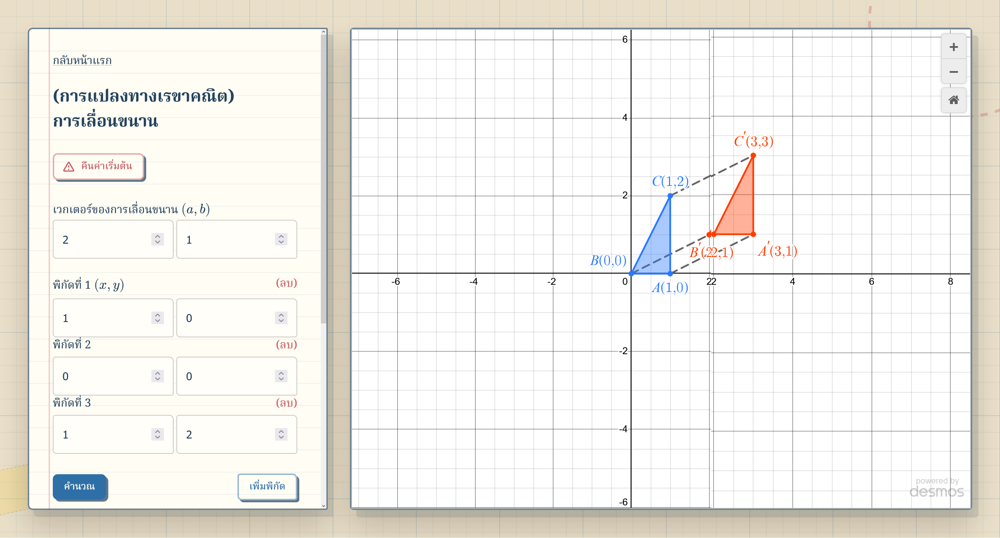
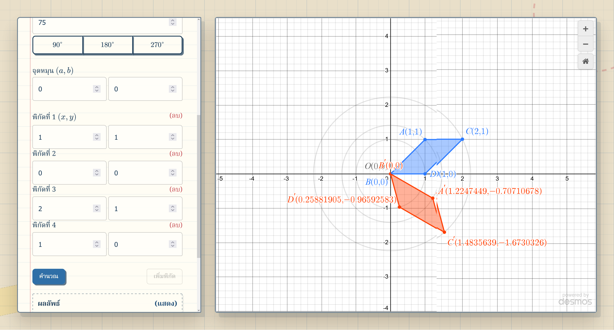
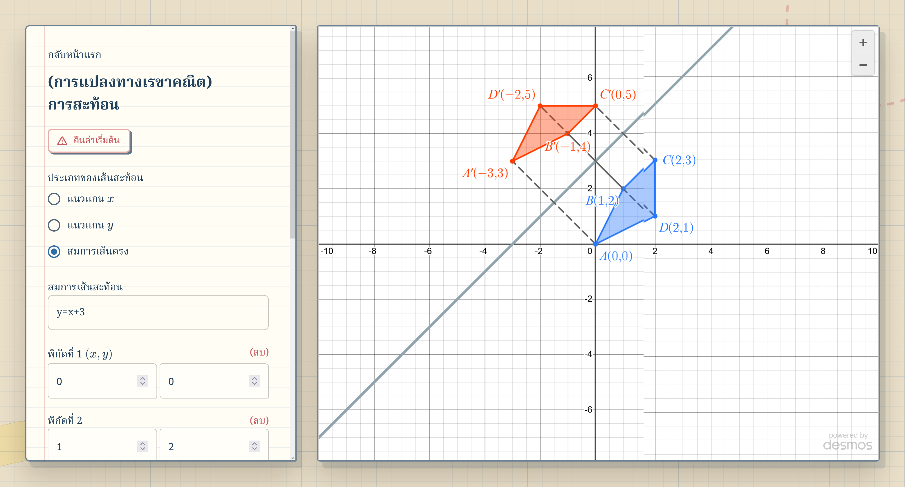

# ~Geometric Transformation Explorer 

An educational tool for visualizing geometric transformation on a 2D plane powered by [Desmos' graphing calculator API](https://www.desmos.com/api/v1.11/docs/index.html) includes translation, rotation, and reflection.

## ~Translation

## ~Rotation

## ~Reflection

